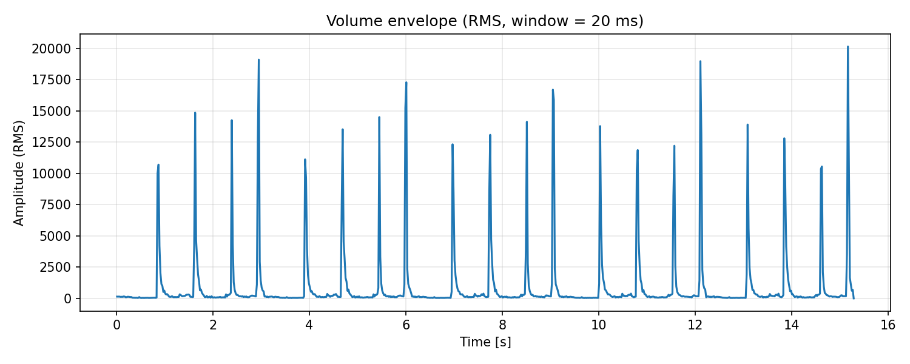

# Audio to csv

Converts an audio file to mono or stereo channel values in a csv file. Includes
utility function to visualize audio changes.



## Install Requirements

```bash
python3 -m venv .venv
source .venv/bin/activate
pip install -r requirements.txt
```

## Usage

Ex.

```py
video_audio_to_csv(
    "sample.mp4",
    csv_path="result.csv",
    sample_rate=48_000,
    mono=True,
    rename=True,
)

plot_volume_envelope(
    "result.csv",
    44_100,
    50,
    "graph.png",
)
```

