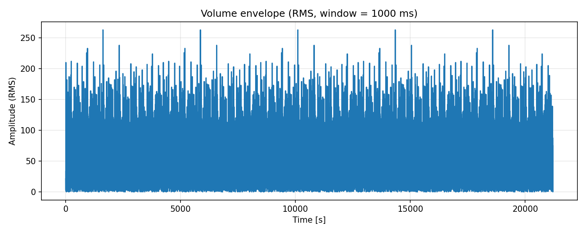

# Audio to .csv



This project facilitates the training of a machine learning model on audio data
by providing the following features:

- Transform audio files into .csv format.
- Visualize the generated .csv data with `matplotlib`.
- Convert .csv data values into decibels.
- Extend audio data by looping it seamlessly to create longer samples.
- Normalize decibel values to prepare them for model training.

This was utilized to introduce deliberate noise into audio data for training
models in Nea.

## Install Requirements

```bash
python3 -m venv .venv
source .venv/bin/activate
pip install -r requirements.txt
```

## Usage

see bottom of `audio_to_csv.py`

